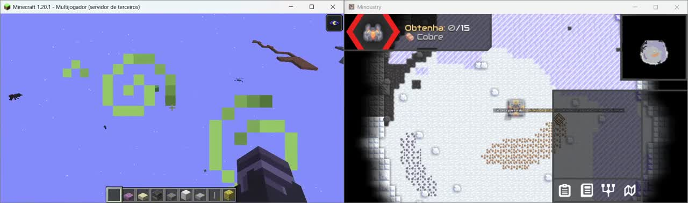
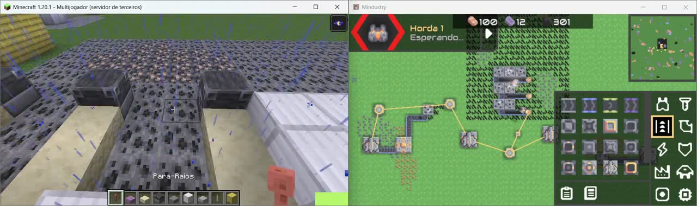
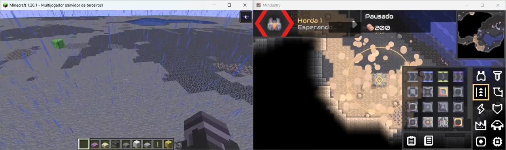

# Multi-Sandbox Engine (MSE)

**World Sync Update — v1.2.0**

> Minecraft ↔ Mindustry world synchronization, tested in-game by the project creator.

Multi-Sandbox Engine connects sandbox games through a central Relay and game-specific bridges. Players see a shared world translated into each game's own blocks and player visuals. This experimental update brings complete map snapshots, supported block synchronization in both directions, cross-game chat and visible player proxies.

## World Sync in action

Three promotional excerpts from the creator's local test recordings show the update running in Minecraft 1.20.1/Purpur and Mindustry 160.4. Click a preview to watch its MP4.

| Campaign / story mode test | World Sync gameplay test | World Sync gameplay test |
| --- | --- | --- |
| [](docs/media/world-sync-demo-1.mp4) | [](docs/media/world-sync-demo-2.mp4) | [](docs/media/world-sync-demo-3.mp4) |

## What works now

- **World reconstruction:** entering a Mindustry map uploads floors, ore overlays, liquids, natural walls and structures; the Relay reconstructs their Minecraft representations.
- **Two-way mapped block placement and deletion:** Minecraft ↔ Mindustry, with shared object ownership for multi-tile and volumetric structures.
- **Full-volume destruction:** breaking any occupied cell of a Blast Drill removes its complete 4×4×3 representation and the Mindustry structure.
- **Cross-game chat.**
- **Player Proxy:** Mindustry players appear as Phantom proxies in Minecraft; Minecraft players appear as visual Dagger sprites in Mindustry, with interpolated movement and corrected heading.
- **Drill and power mappings:** Mechanical/Pneumatic/Laser/Blast Drills, generators, kilns and power nodes.
- **Mass Driver:** corrected 3×3×2 bamboo-plank representation.
- **Titanium conveyors:** both sandstone slab variants are accepted from Minecraft.
- **Cores:** yellow terracotta, with footprints matching the six core variants. A new Minecraft yellow-terracotta placement defaults to Core Shard.
- **Reconnect support:** the Minecraft bridge retries the Relay connection; Mindustry requests another snapshot when the Relay restarts.

Unmapped scenery and buildings receive provisional visuals while the Relay retains their original Mindustry content names. This allows a map to appear before every block has a dedicated visual mapping.

## Campaign / story mode: semi-compatible

**MSE is partially ("semi") compatible with Mindustry's campaign/story mode.** The creator tested World Sync in a campaign sector, shown in the first video above. World reconstruction and the existing bridge features can work while a campaign map is running.

This does **not** mean the campaign itself is synchronized: sector progression, objectives, waves/enemies, research, inventories, resource transport and power simulation are not shared with Minecraft. Campaign compatibility is experimental and has been demonstrated in the recorded test, not verified across all sectors or saves.

## Game support

| Game | Current bridge | Tested baseline |
| --- | --- | --- |
| Minecraft 1.20.1 | Purpur plugin / WebSocket | World rendering, supported blocks, chat, player proxies |
| Mindustry 160.4 | JavaScript ZIP mod / HTTP events and polling | Map snapshots, supported blocks, chat, player proxies; partial campaign support |
| Mindustry Java mod | Historical Java implementation | **Outdated — use the JavaScript ZIP mod** |

## Mini tutorial — install and run

### 1. Download the matching components

You need **Node.js with npm**, **Java 17 or later**, **Minecraft Java 1.20.1 with a Purpur 1.20.1 server**, and **Mindustry** (tested with 160.4). The tested bridge builds identify themselves as `world-sync-dev2`.

- Download the [Minecraft plugin JAR](https://github.com/EliasXbox/multisandbox-engine/releases/download/v1.2.0/multisandboxengine-minecraft-1.2.0.jar).
- Download the [Mindustry mod ZIP](https://github.com/EliasXbox/multisandbox-engine/releases/download/v1.2.0/multisandbox-engine-mindustry-1.2.0.zip).
- Get the updated Relay from [this World Sync branch](https://github.com/EliasXbox/multisandbox-engine/tree/feature/world-sync-core): use **Code → Download ZIP**, extract it and find `relay-server/`. Keep all three components on this update.

The same tested bridge packages are also preserved in [dist/](dist/).

For this quick setup, run everything on the **same computer**: both bridges connect to `localhost:8080`. Prepare a dedicated empty Minecraft test world and back up your worlds. Leave enough disk space for both games to save.

### 2. Install the two bridges

**Minecraft:** place the downloaded JAR inside the Purpur server's `plugins/` folder. Keep only one version of the MSE plugin installed, then start/restart the server after starting the Relay below.

**Mindustry:** open **Mods → Import Mod**, choose the downloaded ZIP, enable it and restart the game. Check that the installed MSE version includes **World Sync / world-sync-dev2**. Use the ZIP mod; the historical Java mod in the repository is outdated.

### 3. Start the Relay

Open a terminal in the extracted `relay-server` folder. Run:

```bash
npm install
npm start
```

The first command installs dependencies; the second starts the Relay. Keep this terminal open. A successful startup prints:

```text
[Relay Server] MSE World Sync Core listening on :8080
```

You can also open [localhost:8080/health](http://localhost:8080/health) in a browser to check the Relay.

### 4. Connect the games and reconstruct the map

1. With the Relay running, start the Purpur server.
2. Open Minecraft and join that server. For a default server on your own computer, use `localhost` in Multiplayer.
3. Open Mindustry with the mod enabled and enter a playable map or campaign sector.
4. Wait for the map snapshot to finish; large maps may take longer.

The opening order is **Relay → Purpur/Minecraft → Mindustry map**. Mindustry provides the map, and its floors, scenery and structures appear in Minecraft at the mapped coordinates. Terrain sits at **Y=2** and structures begin at **Y=3**, so move to that area to see the reconstruction.

Look for `Snapshot BEGIN` / `Snapshot END` in the Mindustry log and `World snapshot applied` in the Minecraft server log. Try placing a mapped conveyor or drill, breaking it from the other game, sending chat and moving the players.

### If something does not connect

- **Relay does not start:** confirm Node.js/npm are installed, run `npm install` inside `relay-server/`, and check that port 8080 is available.
- **Minecraft does not connect:** check that Purpur loaded the MSE plugin and that the Relay is still running.
- **Mindustry does not connect:** confirm the current ZIP mod is enabled, restart Mindustry after importing it, and enter a map.
- **Connected but no world:** check the snapshot messages, wait for completion and inspect the area around Y=2–3. Use the Relay and both bridges from the same update.
- **Campaign:** the recorded sector test worked, but support remains partial; see the campaign limits above.

Snapshots replace synchronized cells. Proxies are visual, and the games do not share inventories or production simulation.

For developers, build the Minecraft plugin with `mvn package` in `clients/minecraft-bridge/`. The mod source is under `clients/mindustry-bridge/zip mod/`.

## Architecture and coordinates

```text
Mindustry JS mod  <-- HTTP polling / events -->  MSE Relay  <-- WebSocket -->  Minecraft plugin
                                                 |
                                          canonical World State
```

Mindustry is the provisional map authority. The Relay stores semantic objects, their footprints/volumes and their Mindustry anchor tiles, then renders the appropriate game representation. Runtime player proxies are transient.

Dimensions use **X × Z × Y**. Minecraft uses absolute MSE Y coordinates; the old `logical Y + 1` offset is retired. The default terrain surface is Y=2, structures start at Y=3 and Mindustry player proxies use Y=5. Shallow/deep fluids include supporting beds. Axis flips and offsets live in `relay-server/config/world-sync.json`.

See [World Sync protocol](docs/world-sync-protocol.md) and [dev2 update details](docs/world-sync-dev2.md).

## Current limits and next steps

- The map is a geometry/presence reconstruction, not a full gameplay or save transfer.
- Player proxies are visual only; combat, health, collisions and shared inventories are not implemented.
- Terrain/ore reverse editing and complete content-specific mappings remain future work.
- Unmapped buildings use provisional visuals; their production and internal state are not translated.
- Conveyors remain slabs for now. Directional stairs are planned.
- Shared items, crafting, additional games and a Host/Client session interface remain on the roadmap.

## Validation and history

The creator confirmed this update in real gameplay, including reconstruction transitions and a campaign-sector test. Automated regression checks cover the actual Relay handlers, all 48 Blast Drill cells, anchors, replacement cleanup, layered snapshots, fluids, cores, cardinal headings, player update coalescing and proxy interpolation. The Mindustry script compiled with the installed game's Rhino engine; the Minecraft plugin was built and its package verified.

Run `node tests/world-sync-regression.cjs` for the isolated regression checks. They do not connect to live game worlds or modify saves.

**v1.1.1-beta** was the first working one-way Mindustry → Relay → Minecraft milestone. **World Sync dev2** is the new tested baseline, while MSE remains experimental software.

Created by **EliasGX / EliasXbox**. Contributions, experiments and testing are welcome.
